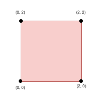
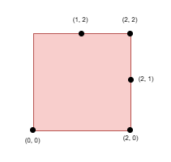
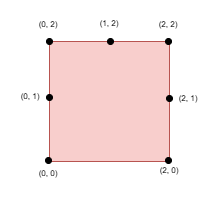

# 3464. Maximize the Distance Between Points on a Square [Hard]
<p>You are given an integer <code><font face="monospace">side</font></code>, representing the edge length of a square with corners at <code>(0, 0)</code>, <code>(0, side)</code>, <code>(side, 0)</code>, and <code>(side, side)</code> on a Cartesian plane.<br>
You are also given a <strong>positive</strong> integer <code>k</code> and a 2D integer array <code>points</code>, where <code>points[i] = [x<sub>i</sub>, y<sub>i</sub>]</code> represents the coordinate of a point lying on the <strong>boundary</strong> of the square.<br>
You need to select <code>k</code> elements among <code>points</code> such that the <strong>minimum</strong> Manhattan distance between any two points is <strong>maximized</strong>.<br>
Return the <strong>maximum</strong> possible <strong>minimum</strong> Manhattan distance between the selected <code>k</code> points.</p>

> The Manhattan Distance between two cells <code>(x<sub>i</sub>, y<sub>i</sub>)</code> and <code>(x<sub>j</sub>, y<sub>j</sub>)</code> is <code>|x<sub>i</sub> - x<sub>j</sub>| + |y<sub>i</sub> - y<sub>j</sub>|</code>.

## Example 1:
**Input:** `side = 2, points = [[0,2],[2,0],[2,2],[0,0]], k = 4`\
**Output:** `2`\
**Explanation:**\
\
Select all four points.

## Example 2:
**Input:** `side = 2, points = [[0,0],[1,2],[2,0],[2,2],[2,1]], k = 4`\
**Output:** `1`\
**Explanation:**\
\
Select the points `(0, 0)`, `(2, 0)`, `(2, 2)`, and `(2, 1)`.

## Example 3:
**Input:** `side = 2, points = [[0,0],[0,1],[0,2],[1,2],[2,0],[2,2],[2,1]], k = 5`\
**Output:** `1`\
**Explanation:**\
\
Select the points `(0, 0)`, `(0, 1)`, `(0, 2)`, `(1, 2)`, and `(2, 2)`.

## Constraints:
- `1 <= side <= 109`
- `4 <= points.length <= min(4 * side, 15 * 10^3)`
- `points[i] == [xi, yi]`
- The input is generated such that:
    - `points[i]` lies on the boundary of the square.
    - All `points[i]` are unique.
- `4 <= k <= min(25, points.length)`

# Note
> https://leetcode.com/problems/maximize-the-distance-between-points-on-a-square/editorial


**SOLUTION**
```Cpp
class Solution {
public:
    int maxDistance(int side, vector<vector<int>>& points, int k) {
        vector<long long> arr;

        for (auto& p : points) {
            int x = p[0], y = p[1];
            if (x == 0) {
                arr.push_back(y);
            } else if (y == side) {
                arr.push_back(side + x);
            } else if (x == side) {
                arr.push_back(side * 3LL - y);
            } else {
                arr.push_back(side * 4LL - x);
            }
        }
        sort(arr.begin(), arr.end());

        auto check = [&](long long limit) -> bool {
            for (long long start : arr) {
                long long end = start + side * 4LL - limit;
                long long cur = start;
                for (int i = 0; i < k - 1; i++) {
                    auto it = ranges::lower_bound(arr, cur + limit);
                    if (it == arr.end() || *it > end) {
                        cur = -1;
                        break;
                    }
                    cur = *it;
                }
                if (cur >= 0) {
                    return true;
                }
            }
            return false;
        };

        long long lo = 1, hi = side;
        int ans = 0;
        while (lo <= hi) {
            long long mid = (lo + hi) / 2;
            if (check(mid)) {
                lo = mid + 1;
                ans = mid;
            } else {
                hi = mid - 1;
            }
        }

        return ans;
    }
};
```

### Time Complexity Analysis
Let `n` be the number of points, `k` be the given integer, and `side` be the side length of the square.
- Time complexity: *O(nk ⋅ log <sub>side</sub> ⋅ log n)*.\
  Sorting takes O(nlogn). Each feasibility check takes O(nklogn), and binary search runs for at most logside iterations. Therefore, the total time complexity is O(nk⋅logside⋅logn).
- Space complexity: *O(n)*.

