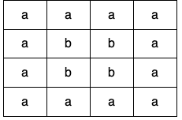
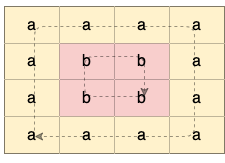
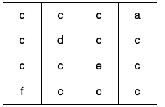
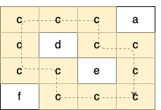
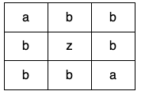

# 1559. Detect Cycles in 2D Grid [Medium]
>Given a 2D array of characters `grid` of size `m x n`, you need to find if there exists any cycle consisting of the 
> **same value** in `grid`.
> 
> A cycle is a path of **length** 4 or more in the grid that starts and ends at the same cell. From a given cell, you can move to one of the cells adjacent to it - in one of the four directions (up, down, left, or right), if it has the **same value** of the current cell.\
> 
> Also, you cannot move to the cell that you visited in your last move. For example, the cycle `(1, 1) -> (1, 2) -> (1,
 > 1)` is invalid because from `(1, 2)` we visited `(1, 1)` which was the last visited cell.
> 
> Return `true` if any cycle of the same value exists in `grid`, otherwise, return `false`.

## Example 1:
\
**Input:** `grid = [["a","a","a","a"],["a","b","b","a"],["a","b","b","a"],["a","a","a","a"]]`\
**Output:** `true`\
**Explanation:** `There are two valid cycles shown in different colors in the image below:`\


## Example 2:
\
**Input:** `grid = [["c","c","c","a"],["c","d","c","c"],["c","c","e","c"],["f","c","c","c"]]`\
**Output:** `true`\
**Explanation:** `There is only one valid cycle highlighted in the image below:`\


## Example 3:
\
**Input:** `grid = [["a","b","b"],["b","z","b"],["b","b","a"]]`\
**Output:** `false`

## Constraints:
- `m == grid.length`
- `n == grid[i].length`
- `1 <= m, n <= 500`
- `grid` consists only of lowercase English letters.

# Note
> https://leetcode.com/problems/detect-cycles-in-2d-grid

**SOLUTION**
```C++
class UnionFind {
public:
    vector<int> parent;
    vector<int> size;
    int n;
    int setCount;

public:
    UnionFind(int _n) : n(_n), setCount(_n), parent(_n), size(_n, 1) {
        iota(parent.begin(), parent.end(), 0);
    }

    int findset(int x) {
        return parent[x] == x ? x : parent[x] = findset(parent[x]);
    }

    void unite(int x, int y) {
        if (size[x] < size[y]) {
            swap(x, y);
        }
        parent[y] = x;
        size[x] += size[y];
        --setCount;
    }

    bool findAndUnite(int x, int y) {
        int parentX = findset(x);
        int parentY = findset(y);
        if (parentX != parentY) {
            unite(parentX, parentY);
            return true;
        }
        return false;
    }
};

class Solution {
public:
    bool containsCycle(vector<vector<char>>& grid) {
        int m = grid.size();
        int n = grid[0].size();
        UnionFind uf(m * n);
        for (int i = 0; i < m; ++i) {
            for (int j = 0; j < n; ++j) {
                if (i > 0 && grid[i][j] == grid[i - 1][j]) {
                    if (!uf.findAndUnite(i * n + j, (i - 1) * n + j)) {
                        return true;
                    }
                }
                if (j > 0 && grid[i][j] == grid[i][j - 1]) {
                    if (!uf.findAndUnite(i * n + j, i * n + j - 1)) {
                        return true;
                    }
                }
            }
        }
        return false;
    }
};
```
### Time Complexity Analysis
**Time complexity:** `O(mn⋅α(mn))`.\
The Union-Find structure uses path compression and union by size or rank, resulting in an amortized cost of α(mn) per operation. Each position participates in at most two union operations, leading to a total complexity of O(mn⋅α(mn)).

**Space complexity:** `O(mn)`.\
This is the space required for the Union-Find data structure.
