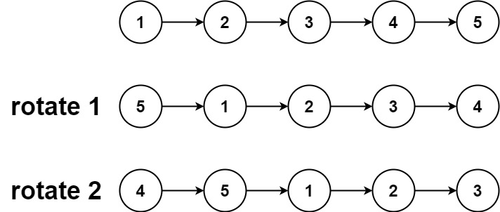
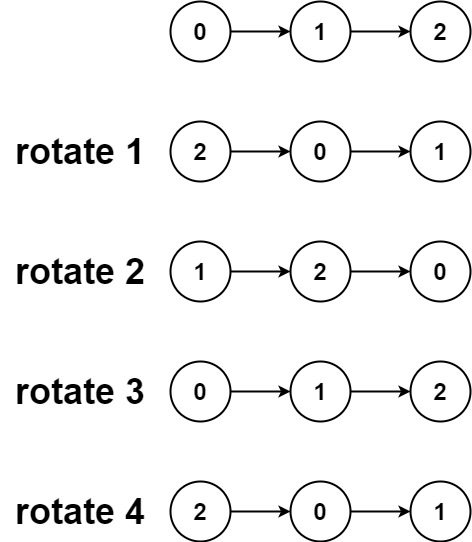

# 61. Rotate List [Medium]
> Given the `head` of a linked list, rotate the list to the right by `k` places.

## Example 1:
\
**Input:** `head = [1,2,3,4,5], k = 2`\
**Output:** `[4,5,1,2,3]`

## Example 2:
\
**Input:** `head = [0,1,2], k = 4`\
**Output:** `[2,0,1]]`

## Constraints:
- `The number of nodes in the list is in the range [0, 500].`
- `-100 <= Node.val <= 100`
- `0 <= k <= 2 * 109`

# Note
> https://leetcode.com/problems/rotate-list

**SOLUTION**
```C++
/**
 * Definition for singly-linked list.
 * struct ListNode {
 *     int val;
 *     ListNode *next;
 *     ListNode() : val(0), next(nullptr) {}
 *     ListNode(int x) : val(x), next(nullptr) {}
 *     ListNode(int x, ListNode *next) : val(x), next(next) {}
 * };
 */


class Solution {
public:
    ListNode* rotateRight(ListNode* head, int k) {
        if (!head || !head->next || k == 0) return head;

        //find length and last node
        int n = 1;
        ListNode* tail = head;
        while (tail->next) {
            tail = tail->next;
            n++;
        }

        // reduce k
        k = k % n;
        if (k == 0) return head;

        // make circular
        tail->next = head;

        // find new tail (n - k - 1 steps)
        int steps = n - k;
        ListNode* newTail = head;
        while (--steps) {
            newTail = newTail->next;
        }

        // break circle
        ListNode* newHead = newTail->next;
        newTail->next = nullptr;

        return newHead;
    }
};
```
### Time Complexity Analysis
**Time complexity:** `O(n)`

**Space complexity:** `O(1)`