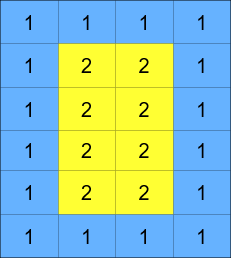
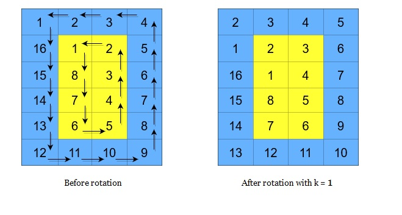
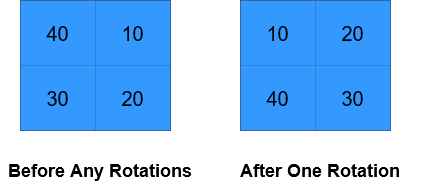
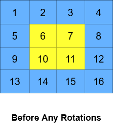
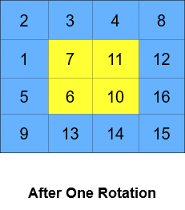
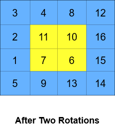

# 1914. Cyclically Rotating a Grid [Medium]
> You are given an `m x n` integer matrix `grid`, where `m` and `n` are **both** even integers, and an integer `k`. 
> The matrix is composed of several layers, which is shown in the below image, where each color is its own layer:\
\
A cyclic rotation of the matrix is done by cyclically rotating **each layer** in the matrix. To cyclically rotate a layer once, each element in the layer will take the place of the adjacent element in the **counter-clockwise** direction. An example rotation is shown below:\
\
Return _the matrix after applying `k` cyclic rotations to it._

## Example 1:
\
**Input:** `grid = [[40,10],[30,20]], k = 1`\
**Output:** `[[10,20],[40,30]]`\
**Explanation:** `The figures above represent the grid at every state.`

## Example 2:
  \
**Input:** `grid = [[1,2,3,4],[5,6,7,8],[9,10,11,12],[13,14,15,16]], k = 2`\
**Output:** `[[3,4,8,12],[2,11,10,16],[1,7,6,15],[5,9,13,14]]`\
**Explanation:** `The figures above represent the grid at every state.`

## Constraints:
- `m == grid.length`
- `n == grid[i].length`
- `2 <= m, n <= 50`
- Both `m` and `n` are **even** integers.
- `1 <= grid[i][j] <= 5000`
- `1 <= k <= 10^9`

# Note
> https://leetcode.com/problems/cyclically-rotating-a-grid

**SOLUTION**
```C++
class Solution {
public:
    vector<vector<int>> rotateGrid(vector<vector<int>>& grid, int k) {
        int m = grid.size();
        int n = grid[0].size();
        int nlayer = min(m / 2, n / 2);  // level count
        // enumerate each layer counterclockwise starting from the top-left
        // corner
        for (int layer = 0; layer < nlayer; ++layer) {
            vector<int> r, c,
                val;  // each element's row index, column index, and value
            for (int i = layer; i < m - layer - 1; ++i) {  // left
                r.push_back(i);
                c.push_back(layer);
                val.push_back(grid[i][layer]);
            }
            for (int j = layer; j < n - layer - 1; ++j) {  // down
                r.push_back(m - layer - 1);
                c.push_back(j);
                val.push_back(grid[m - layer - 1][j]);
            }
            for (int i = m - layer - 1; i > layer; --i) {  // right
                r.push_back(i);
                c.push_back(n - layer - 1);
                val.push_back(grid[i][n - layer - 1]);
            }
            for (int j = n - layer - 1; j > layer; --j) {  // up
                r.push_back(layer);
                c.push_back(j);
                val.push_back(grid[layer][j]);
            }
            int total = val.size();  // total number of elements in each layer
            int kk = k % total;      // equivalent number of rotations
            // find the value at each index after rotation
            for (int i = 0; i < total; ++i) {
                int idx =
                    (i + total - kk) % total;  // the index corresponding to the
                                               // value after rotation
                grid[r[i]][c[i]] = val[idx];
            }
        }
        return grid;
    }
};
```
### Time Complexity Analysis
**Time complexity:** 

**Space complexity:**