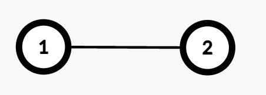
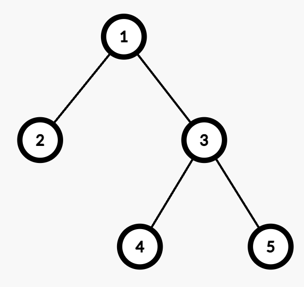

# 3558. Number of Ways to Assign Edge Weights I [Medium]
> There is an undirected tree with `n` nodes labeled from 1 to `n`, rooted at node 1. The tree is represented by a 2D integer array `edges` of length `n - 1`, where `edges[i] = [ui, vi]` indicates that there is an edge between nodes `ui` and `vi`.
> 
> Initially, all edges have a weight of 0. You must assign each edge a weight of either **1** or **2**.
> 
> The **cost** of a path between any two nodes `u` and `v` is the total weight of all edges in the path connecting them.
> 
> Select any one node `x` at the **maximum** depth. Return the number of ways to assign edge weights in the path from node 1 to `x` such that its total cost is **odd**.
> 
> Since the answer may be large, return it **modulo** `10^9 + 7.`
> 
> **Note:** Ignore all edges not in the path from node 1 to `x`.

## Example 1:
\
**Input:** `edges = [[1,2]]`\
**Output:** `1`\
**Explanation:** 
```Markdown
- The path from Node 1 to Node 2 consists of one edge (1 → 2).
- Assigning weight 1 makes the cost odd, while 2 makes it even. Thus, the number of valid assignments is 1.
```

## Example 2:
\
**Input:** `edges = [[1,2],[1,3],[3,4],[3,5]]`\
**Output:** `2`\
**Explanation:**
```Markdown
- The maximum depth is 2, with nodes 4 and 5 at the same depth. Either node can be selected for processing.
- For example, the path from Node 1 to Node 4 consists of two edges (1 → 3 and 3 → 4).
- Assigning weights (1,2) or (2,1) results in an odd cost. Thus, the number of valid assignments is 2.
```

## Constraints:
- `2 <= n <= 10^5`
- `edges.length == n - 1`
- `edges[i] == [ui, vi]`
- `1 <= ui, vi <= n`
- `edges` represents a valid tree.

## Note
> https://leetcode.com/problems/number-of-ways-to-assign-edge-weights-i
 
### SOLUTION [Depth-First Search + Mathematics]
```C++
class Solution {
    static constexpr int mod = 1e9 + 7;
    int qpow(int x, int y) {
        int res = 1;
        for (; y; y >>= 1) {
            if (y & 1) {
                res = 1ll * res * x % mod;
            }
            x = 1ll * x * x % mod;
        }
        return res;
    }
    int dfs(vector<vector<int>>& g, int x, int f) {
        int max_dep = 0;
        for (auto& y : g[x]) {
            if (y == f) {
                continue;
            }
            max_dep = max(max_dep, dfs(g, y, x) + 1);
        }
        return max_dep;
    }

public:
    int assignEdgeWeights(vector<vector<int>>& edges) {
        int n = edges.size() + 1;
        vector<vector<int>> g(n + 1);
        for (auto& e : edges) {
            int u = e[0];
            int v = e[1];
            g[u].emplace_back(v);
            g[v].emplace_back(u);
        }
        int max_dep = dfs(g, 1, 0);
        return qpow(2, max_dep - 1);
    }
};
```
### Complexity Analysis

**Time complexity:** `O(n)`
```markdown
The depth-first search traverses each node exactly once, requiring O(n) time. The fast exponentiation step requires O(logn) time. Therefore, the overall time complexity is O(n).
```
**Space complexity:** `O(n)`
```markdown
The adjacency list requires O(n) space, and the recursion stack may also use up to O(n) space in the worst case.
```