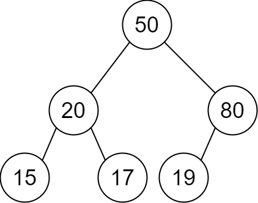
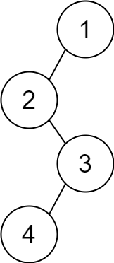

# 2196. Create Binary Tree From Descriptions [Medium]
> You are given a 2D integer array `descriptions` where `descriptions[i] = [parenti, childi, isLeft_i]` indicates that `parent_i` is the **parent** of `child_i` in a **binary** tree of **unique** values. Furthermore,
>  - If `isLeft_i == 1`, then `child_i` is the left child of `parent_i`.
>  - If `isLeft_i == 0`, then `child_i` is the right child of `parent_i`.
>
> Construct the binary tree described by `descriptions` and return _its **root**._\
> The test cases will be generated such that the binary tree is **valid**.

## Example 1:
\
**Input:** `descriptions = [[20,15,1],[20,17,0],[50,20,1],[50,80,0],[80,19,1]]`\
**Output:** `[50,20,80,15,17,19]`\
**Explanation:** 
```Markdown
The root node is the node with value 50 since it has no parent.
The resulting binary tree is shown in the diagram.
```

## Example 2:
\
**Input:** `descriptions = [[1,2,1],[2,3,0],[3,4,1]]`\
**Output:** `[1,2,null,null,3,4]`\
**Explanation:**
```Markdown
The root node is the node with value 1 since it has no parent.
The resulting binary tree is shown in the diagram.
```

## Constraints:
- `1 <= descriptions.length <= 10^4`
- `descriptions[i].length == 3`
- `1 <= parenti, childi <= 10^5`
- `0 <= isLefti <= 1`
- The binary tree described by `descriptions` is valid.

## Note
> https://leetcode.com/problems/create-binary-tree-from-descriptions
 
### SOLUTION (Approach 1: Recursive Solution)
> https://leetcode.com/problems/print-binary-tree/editorial/
```C++
public class Solution {
    public List<List<String>> printTree(TreeNode root) {
        int height = getHeight(root);
        String[][] res = new String[height][(1 << height) - 1];
        for(String[] arr:res)
            Arrays.fill(arr,"");
        List<List<String>> ans = new ArrayList<>();
        fill(res, root, 0, 0, res[0].length);
        for(String[] arr:res)
            ans.add(Arrays.asList(arr));
        return ans;
    }
    public void fill(String[][] res, TreeNode root, int i, int l, int r) {
        if (root == null)
            return;
        res[i][(l + r) / 2] = "" + root.val;
        fill(res, root.left, i + 1, l, (l + r) / 2);
        fill(res, root.right, i + 1, (l + r + 1) / 2, r);
    }
    public int getHeight(TreeNode root) {
        if (root == null)
            return 0;
        return 1 + Math.max(getHeight(root.left), getHeight(root.right));
    }
}
```
### Complexity Analysis

**Time complexity:** 
```markdown
 O(h⋅2^h). We need to fill the res array of size h⋅2^(h)−1. Here, h refers to the height of the given tree.
```

**Space complexity:** 
```markdown
O(h⋅2^h). res array of size h⋅2^(h)−1 is used.
```